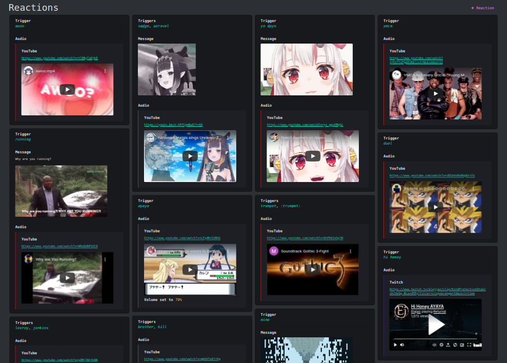
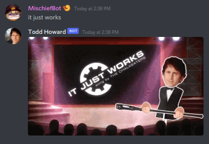

# ANIKI/兄貴 - Discord Bot

<table>
    <tr>
        <td>
            

Tired of your bots being simplistic pieces of text-based drivel? Want more from that regular, ordinary chatbot experience?

Well laddie and-or-inbetween lass, Aniki's got something for you!

**Aniki** will respond to Discord messages with whatever you tell him to. It can be a message, a link, or an audio clip in Voice Chat.

It can also impersonate fake users when delivering messages.
            

        </td>
        <td>
            <figure>
                
                <figcaption><i>The beautiful legendary Billy Herrington.</i></figcaption>
            </figure>
        </td>
    </tr>
</table>

## Features ##
The bot includes a site for adding your custom response. List your trigger words, the terms, phrases, or emotes the bot will look for, and add a message and/or a video URL for an audio response.
<figure>
    
    <figcaption><i>Just look at that chaotic list of garbage memes.</i></figcaption>
</figure>

You can also have the bot pretend to be a user. These are called personas.
<figure>
    
    <figcaption><i>Just like this bot.</i></figcaption>
</figure>